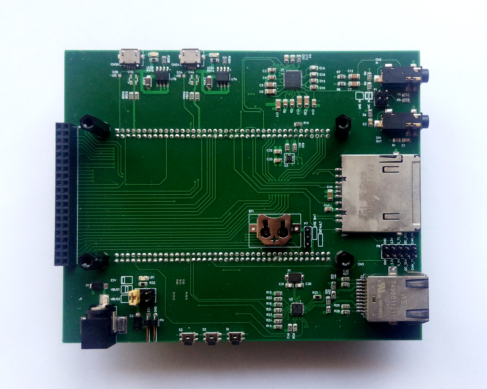
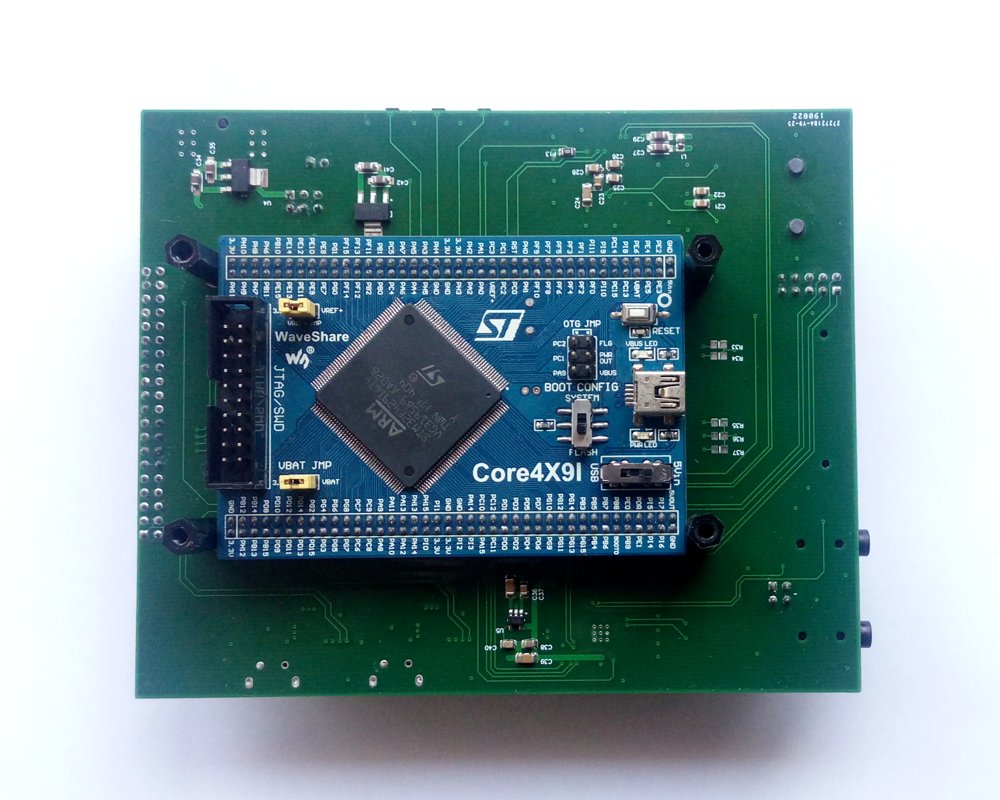
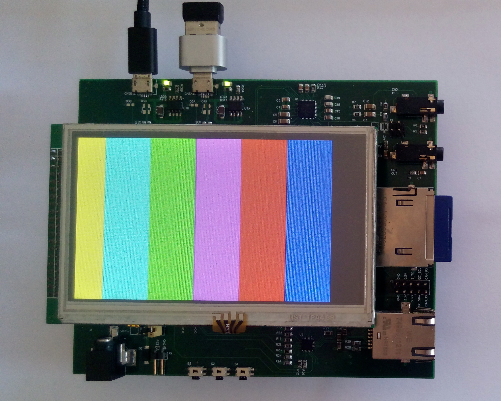

  Core429IBaseBoard is a dev board made for rapid prototyping of multimedia, industrial and 
  IoT apps, based in ST discovery boards, but with detachable cpu modules.

  

  

  

  ### Feature list

  * 5V dc input from USBs, pin header or 5-12v from dc jack.
  * Battery backup (CR1216, CR1220 button cell type).
  * 3 x user switch.
  * 2 x USB FS OTG.
  * SD card (4 bit).
  * [LAN8742](https://www.microchip.com/wwwproducts/en/LAN8742) Ethernet PHY (10/100 Mbit/s).
  * [CS42L52](https://www.cirrus.com/products/cs42l52/) 24-bit, low power stereo audio codec.
  * TFT LCD 40-pin connector with SPI signals (for resistive touch controller).
  * 10 pin header for 3.3V, GND, USART, I2C and CAN signals.
  * 2 x 80-pin connector for cpu module (ref [Core429I](https://www.waveshare.com/product/mcu-tools/core-boards-compact-boards/stm32-core/core429i.htm)).
  * Dimensions: 131.94 x 108.10 mm, 4-layer PCB.